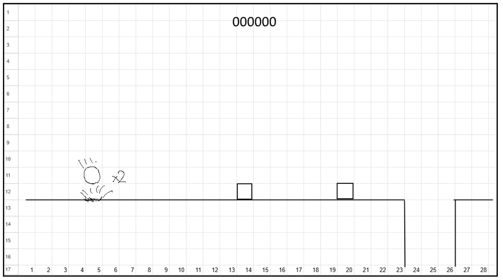

# はじめてのAssistant&Generatorsサポートサイト

## 正誤表

- 紙版の奥付
  - 誤：Unity UIベータ版を使ってみよう！
  - 正：Unity AIベータ版を使ってみよう！


## プロンプトと画像

書籍に掲載したプロンプトのうち、長文のものを、以下に掲載します。コピペして、お試しください。

また、画像素材も掲載しています。ダウンロードのリンクをクリックして、ダウンロードしてください。ダウンロードができない場合は、画像を右クリックして、名前を付けて画像を保存や、別名で画像を保存などを選んで、画像を保存して、ご利用ください。


### 3.6.1 作り方を解説させる

#### 図３.12 ゲーム画面のラフ画像 kousou-rough.png 



<a href="images/kousou-rough.png" download=true>kousou-rough.pngをダウンロードする</a>


#### リスト 3.8 開発手順

```
/ask 次のようなワンボタンの簡単なゲームのプロトタイプを開発したい。開発を進める手順を提案せよ。

# タイトル：ジャンプ＆ポン

## ゲーム開発の目的

ゲームを完成させる経験を積むこと。

## 制約

- 企画の練習や、はじめてでも作れるように、要素が少なくて済むワンキーゲームにする
- 画面は2Dで構成。動きは3Dで開発する

## ゲーム概要

ジャンプと急降下を使って、障害物を壊したり、避けたり、穴を飛び越えてゴールを目指すワンキーゲーム。

## プラットフォーム

Web

## 入力デバイス

キーボード、ゲームパッド、マウスクリック、画面タップ

## 画面解像度

960x540ピクセル

## 開発環境

UnityのLTSの最新版。

## プレイ人数

1人

## 画面のイメージ

添付のkousou_rough.png

## 操作方法

- クリックや画面タップ、スペースキー、ゲームパッドのボタンで操作
- 地上でキーを押すとジャンプ
- ジャンプ中にキーを押すと急降下
- 急降下中は、操作なし
- 障害物を踏むと、ジャンプ

## ルール

- 障害物に横や下からぶつかるか、画面下に落下するとゲームオーバー
- 障害物は、上から踏むと壊せる
- 障害物を壊すと、再ジャンプ＆加速
- ゴールに着いたらクリア
- 床は、上から着地する。横からは、当たり判定なし

## ゲームのプロット

- タイトル＆操作説明＆ランキング。クリック or タップでゲーム開始
- READY & GOの演出。GOまでは、ゲームは停止
- ゲームプレイ
- 障害物に触れるか、落下したらゲームオーバーへ
- ゴールについたらクリアへ
- ゲームオーバー。クリック or タップで、タイトル＆操作説明
- クリア。クリック or タップで、タイトル＆操作説明
```


#### リスト 3.10 キャラクターの開発方法の解説を要求するプロンプト

```
次の操作方法のプレイヤーキャラクターの開発方法を解説せよ

## 操作方法

- クリックや画面タップ、スペースキー、ゲームパッドのボタンで操作
- 地上でキーを押すとジャンプ
- ジャンプ中にキーを押すと急降下
- 急降下中は、操作なし
- 障害物を踏むと、ジャンプ
```


### 3.7.2 キャラクター用のオブジェクトを生成する

#### リスト 3.35 試作用のキャラクター用オブジェクトを生成するプロンプト

```
/run 試作ゲーム用のキャラクターのオブジェクトを、Hierarchyに生成したい。オブジェクトの名前はCharacterとして、CharacterControllerをアタッチする。Characterオブジェクトの子供に、Pivotという名前で、空のゲームオブジェクトを作成する。Pivotの子供に、カプセルのゲームオブジェクトを生成する。カプセルのコライダーは削除する。日本語で回答せよ
```

#### リスト 3.36 試作用のRigidbodyの球体キャラクターを生成するプロンプト

```
/run 試作ゲーム用のキャラクターのオブジェクトを、Hierarchyに生成したい。オブジェクトの名前はRigidbodyCharacterとして、Rigidbodyをアタッチする。作成したオブジェクトの子供に、Pivotという名前で、空のゲームオブジェクトを作成する。Pivotの子供に、Sphereのゲームオブジェクトを生成する。日本語で回答せよ
```

### 3.7.3 床用のプレハブを作成する

#### リスト 3.37 Floorプレハブを生成するプロンプト

```
/run Floorという名前のプレハブを、Prefabsフォルダー内に生成したい。Floorは、空のゲームオブジェクトで、子供にCubeを持つ。FloorとCubeは、いずれもstaticにする。日本語で回答せよ
```

### 3.7.4 床を並べる

#### 図3.25 ピクセルで描いたテスト用のステージ pixel-stage.png


<a href="images/pixel-stage.png" download=true>pixel-stage.pngをダウンロードする</a>

#### リスト3.38 テスト用のステージを配置するプロンプト

```
/run Hierarchyに、Stageという名前の空のゲームオブジェクトを作成して、その子供に、添付したFloorを、プレハブのまま並べて、ステージを作成したい。ステージは、横方向から見るので、FloorはX-Y平面に並べる。添付の画像のインポート設定で、Read/Writeを有効、圧縮をNoneにする。黒のピクセルの位置に、Floorを配置せよ。日本語で回答せよ
```

### 3.8 /codeモード

#### リスト 3.40 /codeモードを試す

```
/code Start時に、Helloとコンソールに出力せよ。ファイル名はHelloCodeとせよ。日本語で回答せよ
```

### 3.8.2 プレイヤーの制御コードを生成する

#### リスト 3.41 プレイヤーを操作するコードを生成するプロンプト

```
/code サイドビューのプラットフォーマーゲームのプレイヤーコードを、PlayerControllerという名前で生成したい。移動には、CharacterControllerを使う。InputSystemのKeyboardを使い、Aキーか左キーで左移動。Dキーか右キーで右移動。スペースキーでジャンプする。ジャンプ中は、ジャンプできない。日本語で回答せよ
```

### 3.8.3 カメラの制御コードを生成する

#### リスト 3.44 プレイヤーを追うカメラのコードを生成するプロンプト

```
/code プレイヤーを追うカメラの移動制御コードを、FollowCameraという名前で生成したい。プレイヤーは、インスペクターから設定する。カメラの位置は、シーンの開始時のプレイヤーとの相対座標を維持する。ただし、下方向は、シーン開始時のカメラのY座標より下がらないようにする。Z方向は移動しない。日本語で回答せよ
```

### 3.8.4 ゲームオーバー判定のコードを生成する

#### リスト 3.45 落下した時のコードを生成するプロンプト

```
/code プレイヤーが、カメラの表示の外に出たら、現在のシーンを再読み込みするコードを生成したい。名前は、MissDetectorとする。日本語で回答せよ
```

### 3.9 シェーダーのコードを生成する

#### リスト 3.48 設定色で塗りつぶす Unlit シェーダーを生成するプロンプト

```
/ask インスペクターで指定した色で描画されるURP用のUnlitシェーダーを生成せよ。日本語で回答せよ
```

### 4.2.2 はじめてのスプライト生成

#### リスト 4.1 サイドビューのジャンプゲームの背景を生成するプロンプト

```
Generate side view jump game background. The background is a blue sky with mountains in the distance and a forest in front of it.Uses only the 16:9 area in the center of the screen. Leave some space above and below.
```

#### リスト 4.3 元の日本語のプロンプト

```
サイドビューのジャンプゲームの背景を生成する。青空で、遠くに山があり、その前に森が広がっている背景。画面の中央の16:9の範囲のみを使う。上下は、スペースを空けること。
```

### 4.2.4 プロンプトをAssistantで生成する

#### リスト 4.5 生成プロンプトをAssistantに生成してもらう

```
/ask Sprite Generatorに、暖色系の鮮やかなグラデーションの空を生成させるためのプロンプトを、英語で作成せよ。また、Negative Promptに記入する項目を、カンマ区切りで列挙せよ
```

### 4.4.2 地面用のマテリアルを生成する

#### リスト 4.6 地面を生成するプロンプト

```
seamless, grass-covered, dirt with scattered pebbles
```

#### リスト 4.8 Groundマテリアルのネガティブプロンプト

```
border, edge, shadows, lighting, gradient, scratches, dirt, writing
```

#### リスト 4.11 レンガのネガティブプロンプト

```
border, edge, shadows, lighting, gradient, writing
```

### 4.6.1 足音を生成する

#### リスト 4.12 足音のプロンプト

```
Footsteps walking on soft soil
```

#### リスト 4.13 足音のネガティブプロンプト

```
noise, reverb, music, distorted, voice
```

### 4.6.2 ジングル音の生成

#### リスト 4.14 いいものを入手したときのプロンプト

```
3 second fanfare when you open a treasure chest in RPG and get something good.
```

#### リスト 4.15 いいものを入手したときのネガティブプロンプト

```
noise, reverb, music, distorted, voice
```
